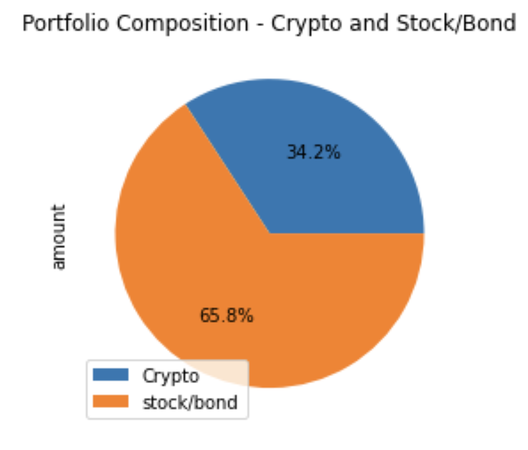
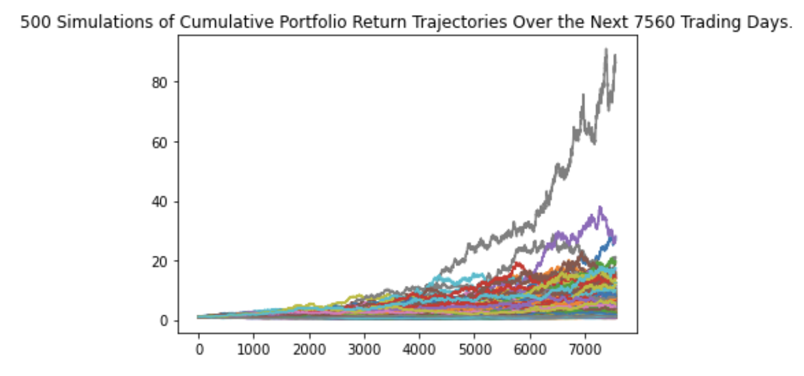
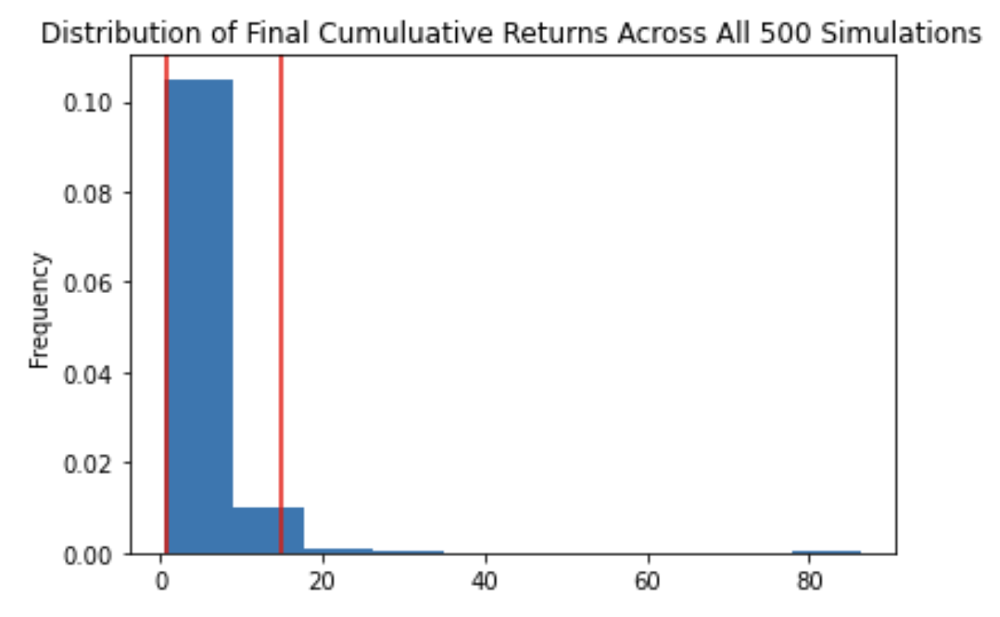
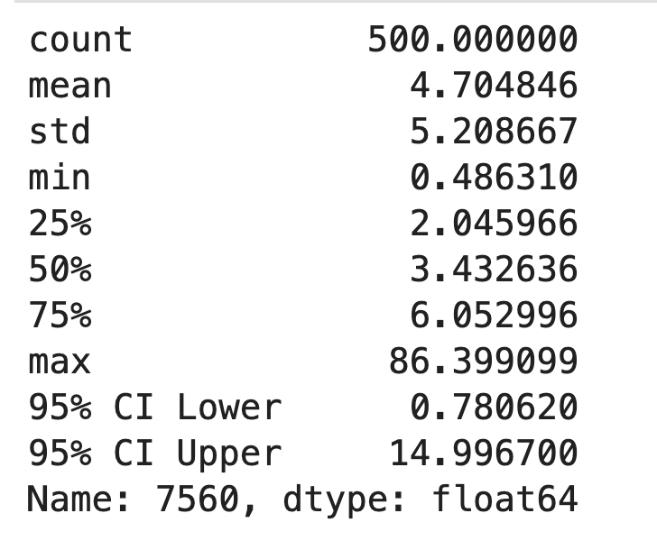
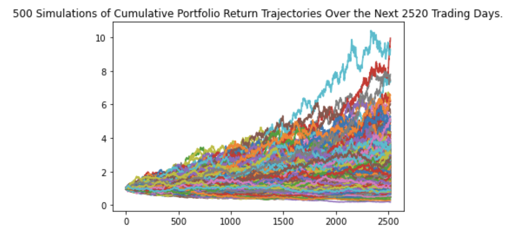
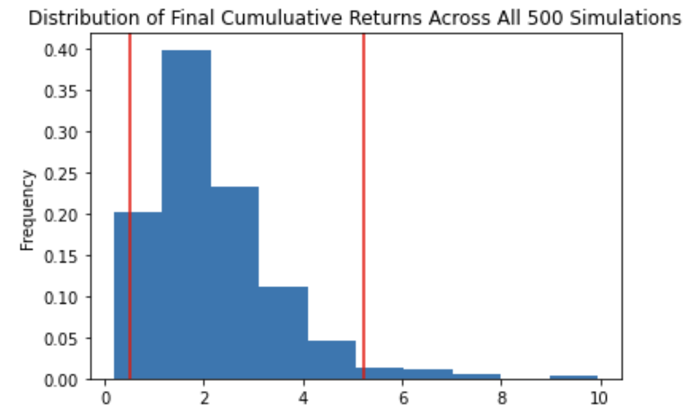
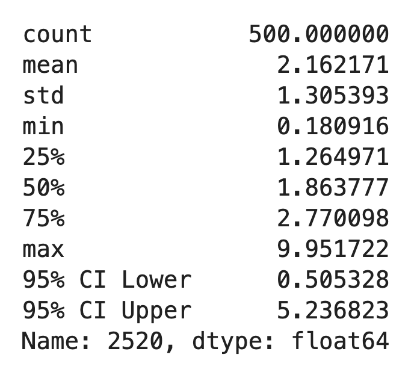

# Financial_Planning_With_API_And_Simulations

### Financial planner for Emergencies/Retirement ###
---

This is a python enabled command line financial analysis tool that helps its users to evaluate their financial health.This includes:

*  **A financial planner for emergencies**: The users will be able to use this tool to visualize their current savings. The users should be able to determine if they have enough reserves for an emergency fund.

* **A financial planner for retirement**: This tool will forecast the performance of their retirement portfolio in 30 years. To do this, the tool will make an Alpaca API call via the Alpaca SDK to get historical price data for use in Monte Carlo simulations.

This tool also allows the user to make some adjustments relating to timeframe , weight composition  and number of samples in order to make a better investment decisions.

---

## Technologies
This project runs on python 3.7 and includes the following libraries and dependencies:

* os
* requests
* json
* load_dotenv from dotenv
* alpaca_trade_api
* Pandas
* MCSimulations from MCForecastTools
* Matplotlib inline
* Jupyter Notebook

---

## Installation Guide

To use the application you need to install the following dependencies.

```python
  pip install matplotlib
  pip install pathlib
  conda install -c anaconda requests
  conda install -c jmcmurray json
  pip install python-dotenv
  pip install alpaca-trade-api
```
---


## Usage

To use this application just clone the repository and run the **jupyterlab** by running the following command on your terminal:

```jupyterlab```

Upon launching the application  on jupyter lab run the file by clicking on the play button on top of the notebook. 


### Usage Examples:
---

### Pie chart that visualizes the composition of the portfolio ###




## Evaluate the Emergency Fund: ##

Using Python, determine if the current portfolio has enough to create an emergency fund as part of the member’s financial plan. Ideally, an emergency fund should equal to three times the user’s monthly income.

```
emergency_fund_value = 3 * monthly_income

# Evaluate the possibility of creating an emergency fund with 3 conditions:
if total_portfolio > emergency_fund_value:
    print("Congratulations! You have enough money in the fund.")
elif total_portfolio == emergency_fund_value:
    print("Congratulations for reaching your financial goal")
else:
    print(f"you still have ${emergency_fund_value - total_portfolio} left to achieve your goal.")

```

### Monte Carlo Simulation (30-Years): ###


**Monte Carlo simulation of 500 samples and 30 years for the 60/40 portfolio**.The following image shows the overlay line plot resulting from a simulation with these characteristics. However, because a random number generator is used to run each live Monte Carlo simulation,your image will differ slightly from this exact image:





**Probability distribution of the Monte Carlo simulation :** The following image shows the histogram plot resulting from a simulation with these characteristics. However, because a random number generator is used to run each live Monte Carlo simulation, your image will differ slightly from this exact image:





## Summary statistics from the 30-year Monte Carlo simulation results: ##





What are the lower and upper bounds for the expected value of the portfolio with a 95% confidence interval?

```
#Use the lower and upper `95%` confidence intervals to calculate the range of the possible outcomes for the current stock/bond portfolio

total_stocks_bonds = 60692.40
ci_lower_thirty_cumulative_return = thirty_years_table[8] * total_stocks_bonds
ci_upper_thirty_cumulative_return = thirty_years_table[9] * total_stocks_bonds

```
#Print the result of your calculations

There is a 95% chance that an initial investment of $60692.40 in the portfolio with a 40% weight in AGG and 60% weight in SPY over the next 30 years will end within in the range of $47377.73 and $910185.73.


## Forecast Cumulative Returns in 10 Years: ##

30 years is a long time to wait until retirement. So, adjust the retirement portfolio and run a new Monte Carlo simulation to find out if the changes will allow to retire earlier. To do this:

* Adjust the weights of the retirement portfolio so that the composition for the Monte Carlo simulation consists of 20% bonds and 80% stocks.

* Run the simulation over 500 samples, and use the same data that the API call to Alpaca generated.


### Monte Carlo Simulation (10-Years): ###








## Summary statistics from the 10-year Monte Carlo simulation results ##





 Using the current value of only the stock and bond portion of the member's portfolio and the summary statistics that you generated from the new Monte Carlo simulation, what are the lower and upper bounds for the expected value of the portfolio (with the new weights) with a 95% confidence interval?

```
# Use the lower and upper `95%` confidence intervals to calculate the range of the possible outcomes for the current stock/bond portfolio

total_stocks_bonds = 60692.40
ci_lower_ten_cumulative_return = ten_years_table[8] * total_stocks_bonds
ci_upper_ten_cumulative_return = ten_years_table[9] * total_stocks_bonds

```

#Print the result of your calculations

There is a 95% chance that an initial investment of $60692.40 in the portfolio with a 20% weight in AGG and 80% weight in SPY over the next 10 years will end within in the range of $30669.58 and $317835.34.


Now the question is, will weighting the portfolio more heavily to stocks allow to retire after only 10 years?

## Conclusion ##

The portfolio with a 20% weight in AGG and 80% weight in SPY over the next 10 years will end within in the range of $30669.58 and $317835.34.An initial investment of $60692.40 in the portfolio with a 40/60 weight over the next 30 years will end within in the range of $47377.73 and $910185.73 which means weighting the portfolio with 40/60 will yield on an average in the range of $15792.58 and $303395.24 every ten years.

Looking across both simulations, the portfolio breakdown with the greatest chance of success looks to be the ten years portfolio.Although both the portfolios have a chance to lose money, the ten years portfolio is roughly the same level of risk with far more upside potential that allows the credit union members to retire after only 10 years.